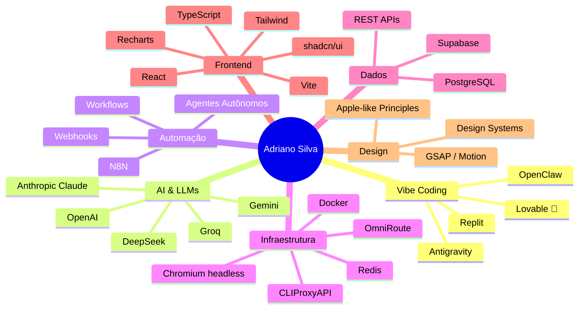

# 👋 Adriano Silva

## AI Builder | Lovable Certified Diamond 💎 | Vibe Coding | AI Agents | Automação Inteligente

  
  
  
  

---

> **📍 São Paulo, Brasil** · [LinkedIn](https://linkedin.com/in/adrianojsilva86) · [Email](mailto:adrianojsilva86@gmail.com) · +55 11 96652-4658

---

## 🚀 Sobre Mim

Sou um **AI Builder** especializado em **Vibe Coding** — transformo ideias em produtos digitais funcionais usando inteligência artificial, automação e plataformas low-code/no-code.

Como **Lovable Certified Diamond**, domino o ecossistema Lovable para criar MVPs, aplicações completas e sistemas inteligentes em tempo recorde. Minha stack combina:

- **Geração de código por IA** → Lovable, Replit, Antigravity, OpenClaw
- **Automação inteligente** → N8N, agentes autônomos, workflows
- **Infraestrutura moderna** → Supabase, APIs REST, cloud deployment
- **LLMs & Agentes** → OpenAI, Gemini, OmniRoute, Hermes Agent

> ⚡ **Missão:** Ajudar empresas a transformar idéias em produtos digitais funcionais em dias, não meses — reduzindo custos, acelerando validação e escalando com IA.

---

## 🏆 Certificações & Formação

| Certificação | Instituição |
|---|---|
| 💎 **Lovable Certified Diamond** | Lovable |
| 🎓 **Pós-graduação — Vibe Coding AI** | Impacta Tecnologia (2026-2027) |
| 🎓 **MBA — IA, Estratégia de Dados e Eficiência** | Frons Educação (2024-2025) |
| 🎓 **Gestão em TI** | Universidade Paulista (2014-2016) |
| 🎓 **Desenvolvimento de Sistemas** | Senac (2014-2015) |

---

## 📂 Projetos & Portfólio

### 📊 [KemaFinance — Gestão Financeira Inteligente](./projects/kema-finance/)
> **Stack:** React · TypeScript · Supabase · shadcn/ui · Gemini AI · Vite · PWA
>
> Sistema completo de gestão financeira pessoal com IA integrada. 19.323 linhas, 14 páginas, 11 tabelas. Dashboard com score financeiro 0-100, relatórios CSV/PDF, consultoria com Gemini AI, metas 50-30-20 e PWA com suporte offline.
>
> **🔗 [Ver repositório →](https://github.com/kemaai/kema-finance)**

### 🤖 [KEMA — Assistente Inteligente](./projects/kema-assistant/)
> **Stack:** Hermes Agent · OmniRoute · LLMs · Python · Docker
> 
> Assistente pessoal autônomo que opera via Telegram com capacidades de:
> - Chat com múltiplos modelos de IA (DeepSeek, Claude, Gemini, Groq)
> - Geração de imagens por IA (Flux via OmniRoute)
> - Navegação web via Chrome headless (Playwright)
> - Transcrição de áudio (Whisper)
> - Busca web via DuckDuckGo
> - TTS em português brasileiro
>
> **🔗 [Ver projeto →](./projects/kema-assistant/)**

### 🌐 [Alura — Agente de Sites & SaaS](./projects/alura-kema/)
> **Stack:** Lovable · Supabase · AI Agents · Vibe Coding
> 
> Agente especializado na criação sites premium e sistemas SaaS com identidade visual única e design Apple-like adaptado.

### ⚙️ [OmniRoute — Infraestrutura de IA](./projects/omniroute-setup/)
> **Stack:** Docker · Redis · Chromium · CLIProxyAPI
> 
> Auditoria completa e configuração do OmniRoute AI Gateway com 2927+ modelos, Redis caching, Chromium headless e importação de contas OAuth. Perfil `latest-web` com suporte a navegação.

### 🔄 [Automações Inteligentes (N8N)](./projects/automation-flows/)
> **Stack:** N8N · Webhooks · APIs REST · IA
> 
> Workflows de automação inteligente conectando LLMs, APIs, bancos de dados e serviços cloud para otimização de processos empresariais.

### 🚀 [Deployment & Sites Premium](./projects/deployment-sites/)
> **Stack:** Lovable · Vibe Coding · Design Systems · Cloud
> 
> Criação e deployment de sites premium e sistemas com metodologia AI-first. Inclui Formação AI Designer, Trade Platform e DealerSites.

### 🎨 [Estudos de Design & Referências](./projects/estudos-design/)
> **Stack:** HTML/CSS · GSAP · Motion Design · Apple-like Design Principles
> 
> Laboratório de estudos de design de alta referência — clones de interfaces premium para estudo de estrutura, motion, storytelling e sistemas de design.

---

## 🛠️ Stack Técnica

---

## 📊 Estatísticas

  

---

## 📬 Contato

| Canal | Link |
|---|---|
| 💼 LinkedIn | [/in/adrianojsilva86](https://linkedin.com/in/adrianojsilva86) |
| 📧 Email | [adrianojsilva86@gmail.com](mailto:adrianojsilva86@gmail.com) |
| 📱 WhatsApp | +55 11 96652-4658 |

---

⚡ <i>"Transformar ideias em produtos digitais funcionais em dias, não meses."</i>

